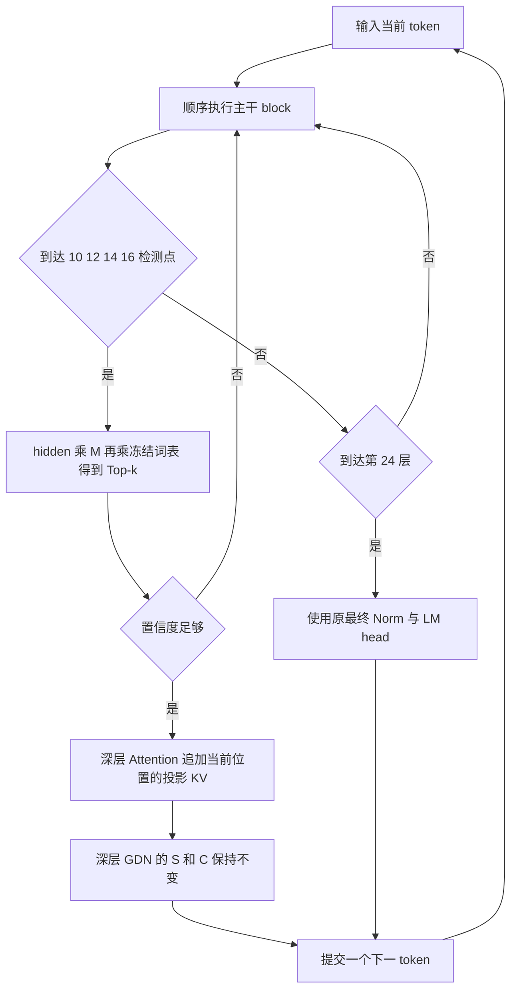

# Hybrid-State CED · Qwen3.5-0.8B

本项目研究 **部分 block 的 Top-k 检测 → 置信度早退 → 深层 Attention KV 投影 → GDN 状态保持 → 下一 token**，在可接受的质量损失内降低逐 token 解码成本。详细设计见[实验计划书](Hybrid-State_CED_Qwen3.5_0.8B_实验计划书.docx)。

核心猜想：能在浅层被高置信度预测的 token 可能携带较少的增量信息，因此无需对后续深层全量计算与写入。退出后只用投影补 full attention 的 KV，被跳过 Gated DeltaNet 的递归状态和卷积缓存都保持不变。**这是待验证假设；容易预测不直接等于可以省略深层记忆写入。**

项目已开展状态地图、缓存注入和 K/V 可恢复性尝试，当前代码实现了这些实验基础；四点检测、置信度和 GDN 保持的动态解码尚待方案审查后实现。本次文档修改未运行训练或更改实验代码。

## 模型与检测位置

使用本地 `models/Qwen3.5-0.8B-Base` 文本主干，冻结主干、嵌入和原 LM head。24 层，隐藏维度 `H=1024`，词表大小 `V=248320`。Full attention 为第 4、8、12、16、20、24 层，使用 8 Q / 2 KV heads、head_dim 256；其余 18 层为 GDN，16 heads、维度 128、conv kernel 4。依据本地配置与 [Qwen 官方配置](https://huggingface.co/Qwen/Qwen3.5-0.8B/raw/main/config.json)。

**文档层号从 1 开始。** 检测头暂定只放在第 **10、12、14、16** 个完整 block 后，对应代码索引 **9、11、13、15**。位置后续根据实验调整，并重新训练或验证、校准。其余 block 不挂检测头；第 16 层仍不退出时，继续至第 24 层使用原最终 Norm 和 LM head。

| 退出深度 | 需要投影 KV 的深层 full attention | 保持 S/C 的深层 GDN 数量 |
|---:|---|---:|
| 10 | 12、16、20、24 | 10 |
| 12 | 16、20、24 | 9 |
| 14 | 16、20、24 | 7 |
| 16 | 20、24 | 6 |

首轮 prompt 完整 prefill，由最终头给出首个生成 token。其后的单 token decode 才使用早退策略，TTFT 单独统计，不预设改善。

## 检测头

采用行向量约定，每个检测点有独立可训练矩阵 `M_d`，所有检测点共享同一冻结大词表矩阵：

```text
d ∈ {10,12,14,16}
h[d,t] : [batch, 1024]          完整 block 的残差输出
M_d    : [1024, 1024]          可训练，初始为单位矩阵
W_vocab: [248320, 1024]        原 LM head 权重，共享且冻结

z      = h[d,t] @ M_d
logits = z @ W_vocab.T
p      = softmax(logits / T_d)
候选   = TopK(p, k)
```

检测支路不额外添加可训练 Norm、非线性网络或独立大词表头。完整模型的最终 Norm/LM head 路径保持原定义。四个矩阵共有 `4×1024² = 4,194,304` 个可训练参数；低秩分解可作后续消融。

冻结完整 teacher 以同前缀最终分布提供蒸馏监督，结合真实下一 token CE 训练 `M_d`。主干与词表不更新，但梯度必须通过冻结词表乘法到达 `M_d`。首轮 greedy、`k=5`，比较 `k∈{1,5,10}`；实际接受 Top-1 并仅输入一个 token，不用 teacher 从 Top-k 中代选。完整 KL 可分块计算；若使用尾部桶近似必须标注。

按配置推算，每次稠密检测约 `H²+HV≈2.55亿 MAC`；走到第 16 层需要四次检测，不退出还需最终读出。冻结词表减少训练量和参数复制，不免除推理成本。必须测量各头调用率及总耗时。

## 置信度与退出

**A 连续检测点稳定。** 比较同一位置在相邻检测点（如 10 与 12）的候选，要求最近 `r` 个检测点 Top-1 一致、相邻 Top-k 集合 Jaccard 重合度和首选概率达阈值。连续指检测点序列，不指连续 block，也不比较不同 token。`r=2/3/4` 最早分别在第 `12/14/16` 层退出；第 10 层不能用纯跨点稳定规则退出。

**B 轻量置信度网络。** 输入只含当前已计算隐藏状态、检测点号、概率间隔、熵、可用候选重合度等，估计该出口 Top-1 与完整 teacher 一致的概率。用训练集内检测矩阵的折外特征和 BCE 拟合，独立校准集只做概率校准与阈值选择。第 10 层使用缺失特征掩码，可以独立决策。teacher 最终分布仅用于离线监督。

比较 A、B、A+B 的风险—覆盖率；若组合要求 A 与 B 同时成立，则最早出口受 A 约束。按领域和出口报告错误退出率、覆盖率、ECE/Brier、样本数及置信区间。概率阈值与检测点配置在测试前锁定；采样生成另测，不承诺与原模型分布精确等价。

## KV 投影与 GDN 保持

处理输入 `x_t` 时，`h[d,t]` 预测 `x_(t+1)`。早退后投影追加的是**位置 t** 的深层 KV，而不是尚未处理的下一 token 的 KV。

- **已经执行的层**：正常运行和更新，包括这些层的 GDN。
- **被跳过的 full attention**：由已计算 `h[a,t], a≤d` 生成目标层 raw K/V；K 经过目标 KNorm 与绝对位置 t 的 RoPE，V 不旋转；每层只追加一次。投影器感知出口 d 和目标层 j。初始使用 `h[d,t]`，融合时不能读取尚未计算的深层特征。
- **被跳过的 GDN**：`S[j,t]=S[j,t-1]`，`C[j,t]=C[j,t-1]`。不执行递归、不移动卷积窗口、不补零、不衰减、不生成替代 GDN 状态。
- **再次执行深层 GDN**：从保留的 S/C 直接处理届时输入，不回补跳过 token。因此卷积窗口对应最近实际执行到该层的输入，不一定是全局连续 token；这是明确的研究近似。
- **位置管理**：全局位置始终推进；所有 attention KV 长度与完整前缀对齐。GDN 另记实际执行次数和跳过位置，不伪造全局位置以适配缓存。

归一化原始投影基线必须先对 source 使用目标层 `input_layernorm`，再使用目标层原 `k_proj/v_proj`。已有 H4/H8/H12 投影尝试提供接口参考，但不能代表四个出口已经支持；第 10 层退出时 H12 不可用。



例如在第 12 层退出：层 1–12 已真实执行；投影补 16/20/24 层的位置 t KV；GDN 13/14/15/17/18/19/21/22/23 的 S/C 不动。下一 token 若走到第 16 层，13/14/15 层从保留状态直接处理它。

KV 投影应验证后统一提交，或能够完整回滚；失败则继续当前 token 的剩余层，不能重复执行已提交层。一次全深度步骤不会自动修复以往预测 KV 或 GDN 省略写入。真实恢复需要从可信检查点重放并计费；主方法不依赖周期性补写 GDN。

## 目前的实验尝试与结果

状态地图与真实缓存 round-trip 已有 PASS 记录，K/V 可恢复性尝试使用 H4/H8/H12 捕获上层真实 self_attn 输入，再生成 raw K/V；训练及评估首批数据验证 KNorm/RoPE 后与真实 cache 一致。比较零、随机线性、归一化原始投影、训练线性、低秩和多层融合。

| 目标层号 | 代码索引 | 方法 | Attention NMSE | 相对原始投影改善 | 局部判定 |
|---:|---:|---|---:|---:|---|
| 16 | 15 | low_rank_256 | 0.138790 | 48.12% | GO |
| 20 | 19 | low_rank_256 | 0.150311 | 42.62% | GO |
| 24 | 23 | low_rank_256 | 0.033002 | 89.54% | GO |

三层联合注入续写仍 **HOLD_REPAIR_KV**：

| 上下文长度 | 预测三层 Mean KL | 归一化原始投影 Mean KL | 预测 Top-1 一致率 |
|---:|---:|---:|---:|
| 256 | 0.111516 | 0.089650 | 88.13% |
| 2048 | 0.293027 | 0.185859 | 80.76% |

每种长度 16 个窗口、128 步相同 token 续写；每层训练 4,999,936 tokens，报告记载 21 项测试通过。这些是项目已有实验记录，本次未重跑。联合损失主要体现在质量下降，不应描述成已观察到递归爆炸。测试窗口已经查看，只用作工程诊断。

**该尝试保留 teacher GDN 状态，研究前缀 KV 替换，没有测试逐 token 退出或 GDN 保持策略。** 局部 GO 为投影参数化提供证据，不能替代闭环验证。详见[状态地图](results/phase0/state_map.md)、[K/V 实验结论](results/phase1_corrected/repair_summary.md)、[联合续写报告](results/phase1_corrected/continuation/report.md)。

## 如何验证低信息假设

先在完整 teacher 前缀上选择策略接受的单个位置，固定后续输入并提供真实 KV，隔离比较跳过该位置深层 GDN 写入与正常写入后的 1/8/32/128 步 KL、Top-1 和任务质量。随后测试连续退出、深浅交替和自由生成。

按置信度、退出深度、跳过长度和 token 类别分组，加入匹配退出数量与深度的随机位置和低置信度位置对照。teacher surprisal、状态改变量只能作为离线解释变量，不能用于在线决策。特别覆盖姓名、数字、否定词、实体复现、代码标识符与长文检索；不能仅凭标点等容易样本验证假设。

| 对照 | 作用 |
|---|---|
| B0 完整模型 | 质量和解码成本基线 |
| B1 完整计算加四个检测头 | 隔离检测成本，最终输出仍取完整模型 |
| B2 固定出口 + 投影 KV + GDN 保持 | 深度 10/12/14/16，对比动态决策 |
| B3 动态退出 + 投影 KV + GDN 保持 | 主方案，比较 A/B/A+B |
| B4 同轨迹 + 真实 KV + GDN 保持 | 隔离 KV 预测误差，仅 oracle 诊断 |
| B5 同轨迹 + 投影 KV + 真实 GDN | 隔离 GDN 省略写入损失，仅 oracle 诊断 |
| B6 同轨迹 + 真实 KV + 真实 GDN | 隔离出口选词误差，仅 oracle 诊断 |
| B7 同轨迹 + 简单 KV + GDN 保持 | 归一化原始投影和显式零 KV，验证投影器价值 |

B3–B7 固定相同退出轨迹与已接受 token 前缀；teacher 重放该前缀提供 oracle 状态，其计算不能进入部署加速比。真实 GDN 只是检验假设的对照，不属于主方法。

## 训练与评价计划

1. 训练四个 M_d，检查冻结权重不变、梯度正确，并测各出口质量和读出成本。
2. 固定检测矩阵，训练置信度网络或校准稳定性规则。
3. 训练出口相关 KV 投影器，验证单次和多层注入；使用 KV、attention 功能和多步 logit 损失。
4. 检验 GDN 保持假设，以真实 KV 隔离，再加入投影 KV；不训练 GDN 状态生成器。
5. 在投影 KV 与保留 GDN 状态上滚动运行；teacher 重放学生前缀提供参照，训练矩阵与投影器后重新校准。
6. 质量达标后测包含全部开销的系统收益，并根据证据调整检测点。

训练、开发、校准、封存测试按文档隔离；已有测试窗口只作诊断。先用 WikiText-103 做工程探针，补充中文、代码、数学和长文检索，固定数据版本、许可和去重。建议 smoke 0.1–0.5M、探针 5–10M、确认阶段 20–50M tokens；初始 batch=1、BF16、prompt 256/2048、生成 128，再测 prompt 8192、生成 512。至少三个训练种子，按文档/窗口做配对 bootstrap，不把相关 token 当独立样本。

以下为待审查的工程初始目标，最终测试前锁定，不代表已有成绩：

| 门槛 | 条件 |
|---|---|
| G0 | 禁用退出等价；仅四点检测；深层 GDN S/C 逐位不变；Attention 长度/位置/写入次数正确 |
| G1 | 接受退出中的错误率 95% 上界 ≤1%，覆盖率 ≥20%，各出口和领域分报 |
| G2 | 投影优于简单 KV 强基线；同 KV、同退出轨迹下 GDN 保持相对 oracle GDN 的额外平均 KL ≤0.02 nats；联合仍过 G3 |
| G3 | 受控 PPL 增幅 ≤3%，预注册任务下降 ≤1 个百分点，平均 KL ≤0.05 nats，长程不持续恶化 |
| G4 | 质量达标后 decode 中位加速 ≥1.10×，95% CI 下界 >1.00×，P95 单 token 时延不劣于基线 |

G2 的“额外 KL”是两组对同前缀完整 teacher 的平均 KL 之差，不是两模型 KL 的代数分解；同时报告置信区间、任务差异和失败样本。统计完整退出深度分布、含回退的平均深度、各 GDN 写入率和最大连续跳过长度，检测头调用率。

质量分受控同前缀、teacher 重放学生前缀、自由生成；测单次及连续 1/4/16/64 次退出、深浅交替，记录逐步与首末 32 步误差、重复和截断。性能包含主干、hM、冻结词表读出、Top-k、置信度、KV 投影、写缓存、同步、回退和重放；固定精度/backend、预热并同步 GPU，至少 30 个配对窗口，报告中位数、P95、95% CI、tokens/s、显存。固定长度与自然 EOS 分开。

状态地图的时延只覆盖 text backbone 和 cache，不含 LM head，不能直接作为端到端基线。GDN 保持质量不达标时应调整退出条件或检测位置，并如实报告假设边界；不把 GDN 补全隐含加入主方法。

## 当前代码与运行入口

固定环境为 Conda `ai`；以下入口用于当前已实现的状态地图、K/V 探针和续写实验，**不是动态早退运行命令**。在项目目录执行：

```bash
conda run -n ai python scripts/check_environment.py
```

状态地图与缓存接口验证：

```bash
./scripts/run_phase0.sh
```

数据准备、K/V 训练评估与复验：

```bash
./scripts/run_phase1.sh
```

已有数据时运行完整 K/V 复验流程，包含三层训练评估、联合续写与测试：

```bash
conda run -n ai python scripts/run_phase1_corrected.py
```

单目标层训练或评估以配置中的 `target_layer` 为准，默认代码索引 19：

```bash
conda run -n ai python scripts/train_kv_probe.py --config configs/qwen35_08b_phase1.yaml
conda run -n ai python scripts/evaluate_kv_probe.py --config configs/qwen35_08b_phase1.yaml
```

测试入口：

```bash
conda run -n ai python -m unittest discover -s tests -v
CED_RUN_MODEL_TESTS=1 conda run -n ai python -m unittest discover -s tests -v
```

| 目录 | 当前作用 |
|---|---|
| `configs/` | 状态地图、K/V 探针和续写配置 |
| `phase0/` | 状态结构、异构 cache 克隆/注入、测量与报告 |
| `phase1/` | 真实目标捕获、K/V 投影模型、指标与数据 IO |
| `scripts/` | 环境、数据准备、训练、评估及流程入口 |
| `tests/` | 接口、形状、指标、缓存和真实模型检查 |
| `data/phase1_wikitext103/` | token shards 与 manifest |
| `results/phase0/` | 状态地图与验证记录 |
| `results/phase1_corrected/` | 三层探针、联合续写及实验报告 |
| `checkpoints/phase1_corrected/` | K/V probe 权重，不包含检测矩阵或置信度网络 |
| `models/Qwen3.5-0.8B-Base/` | 模型与 tokenizer |

代码实施需增加四点矩阵检测、confidence、按出口的 KV projector 和 GDN 保持调度。必须验证 S/C 跳过时逐位不变、再次执行不补写、全局位置不变形、失败回退不重复写入、浅层不读取未来，以及禁用退出完全恢复完整模型。所有 OOM、backend 差异或未完成实验如实记录。

## 参考依据

- [Qwen3.5 官方配置](https://huggingface.co/Qwen/Qwen3.5-0.8B/raw/main/config.json)与[Transformers 文档](https://huggingface.co/docs/transformers/model_doc/qwen3_5)。Base 精确结构以本地模型 config 为准。
- [Confident Adaptive Language Modeling](https://arxiv.org/abs/2207.07061)：置信度与动态早退。
- [Jump to Conclusions](https://arxiv.org/abs/2303.09435)：中间层线性映射读出。

研究关注选择性退出、GDN 写入省略和 KV 投影的联合质量—成本边界，不预先宣称原创性、实验成功或实际加速。
